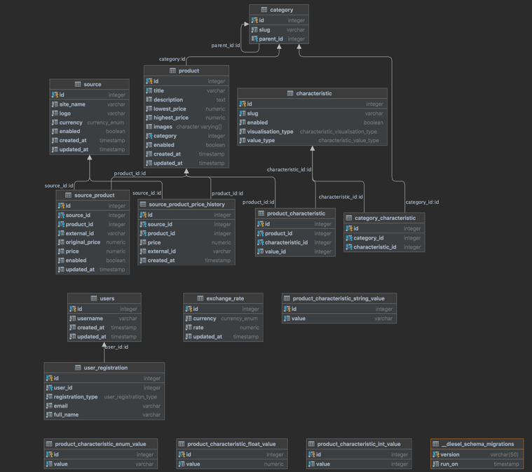

## Database

### Category

- It is a nested tree structure.
- `slug` is used as key for translations on fe.

### Product

- The main entity of the system.
- Every product is attached to category.
- `title` is unique across table and aggregates this product on different sources.
- `description` is a html text which can have p, ul, li and other primitive tags.
- `lowest_price` & `highest_price` are denormalized columns for simplicity of usage and performance improvement. Both of
  them are always in euro.
- `images` is an array of urls to the s3, without hostname. This way we can easily move all our data to another cloud
  storage without update of products.

### Source

- It is an entity which describes source of data. Url, currency etc

### Source_product

- It is a representation of product on specific source.
- `external_id` is a link to product on the source.
- `original_price` is a local price of product on source. In currency of source. As we use price everywhere in euro and
  exchange rates change very often, we use this price to determine if price has changed.
- `price` in euro. Value which is used in all other cases.

### Source_product_history

- Every time price changes on source we save it here. Used for graphs on fe.

### Characteristic

- All `id`s are hardcoded to know them in compile time on rust side.
- `slug` is used for translations and is generated from the rust Enum.
- `visualisation_type` is used on fe to determine how to visualize filter.
- `value_type` is typing on rust side.

All the architecture of product characteristics is dictated by the fact that both rust and postgresql should always know
a datatype of field/column. That's why every type is stored in separate table. Also, this speeds up search.

### Product_string_characteristic_value, Product_enum_characteristic_value, Product_enum_float_value, Product_enum_int_value

- These are these tables to store typed values of characteristics. All of them just have typed `value` field and `id`.

### Category_characteristic

- It is just a mapping table from category to characteristic. We need these mapping to easily determine which filters to
  show when user selected category on fe.

### Product_characteristic

- Many to many for products and characteristics with a few exceptions.
- `value_id` is not a foreign key because it literally points to 4 tables.
- There are 2 types of characteristic types which don't have special tables to store values: `int` and `bool`. It is
  because there values are stored directly in `value_id` field. Bool is stored as 1 or 0. Int is stored as it is. All
  these was done to have less SELECTs/JOINs and less mapping on rust side.

### Exchange_rate

- A table which stores exchange rates for different currency. Stores only the up-to-date value, no history.

### diesel_schema_migrations

- A utility table. Diesel is a tool to run migrations.