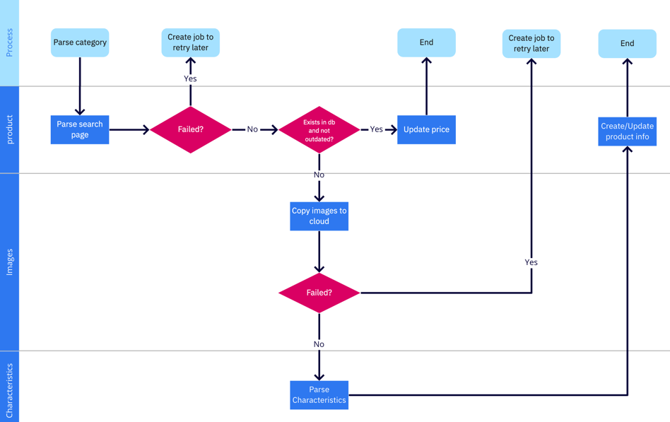

## Producers

Not all the jobs are created by producers. But some of them are:

### parse_category

This producer iterates through the all sources and there categories and creates jobs for each one.

### pull_exchange_rates

This producer does nth except creating a job which is more like a flag to start. No info inside job itself.

## Consumers

### parse_category

This is the main consumer of the app. It finds needed parser based on source and executes it.

1. At first step it iterates through the pages of products and parses only basic info. Such as title, price and if it is
   enabled.
2. If product is found first time, then it requests product page and parsed images, description & characteristics.
3. If parsing failed on some step, the retry job is created in queue.

### parse_image

This consumer tries to upload images to cloud.

### parse_page

This consumer tries to execute all the process of parsing which `parse_category` does but for 1 page only.

### pull_exchange_rates

This consumer requests api for actual exchange rates and saves them to db.